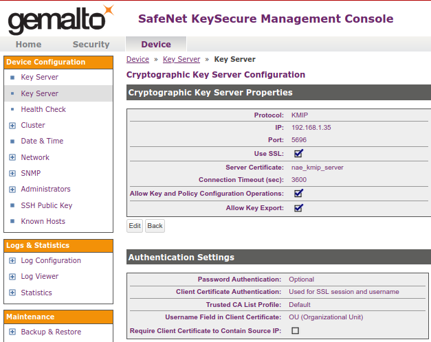
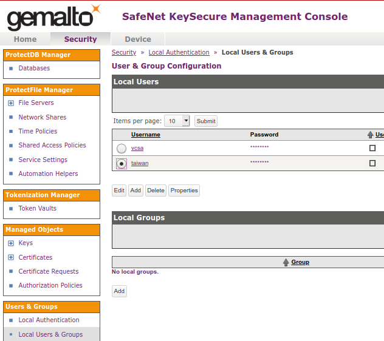
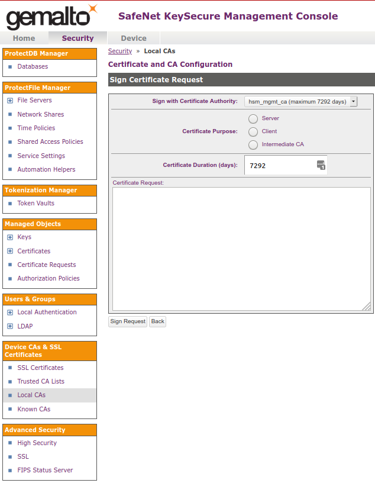
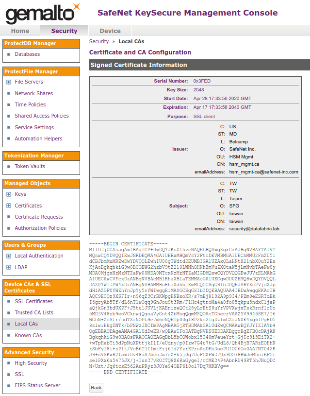

# SolidFire Encryption at Rest with External Key Manager (Thales SafeNet KeySecure)

- [SolidFire Encryption at Rest with External Key Manager (Thales SafeNet KeySecure)](#solidfire-encryption-at-rest-with-external-key-manager-thales-safenet-keysecure)
  - [What's inside](#whats-inside)
  - [Workflow](#workflow)
  - [Notes](#notes)
    - [Customize Ciphers for SolidFire TLS certificate](#customize-ciphers-for-solidfire-tls-certificate)
    - [Automate KMIP integration with PowerShell](#automate-kmip-integration-with-powershell)
    - [KeySecure Management Console](#keysecure-management-console)
  - [Create SolidFire Cluster Key Pair](#create-solidfire-cluster-key-pair)
  - [Create CSR](#create-csr)
  - [Sign SolidFire Cluster CSR with CA key in SafeNet KeySecure UI](#sign-solidfire-cluster-csr-with-ca-key-in-safenet-keysecure-ui)
  - [Create KMIP Key Provider and Server(s)](#create-kmip-key-provider-and-servers)
  - [Attach KMIP Server to KMIP Provider](#attach-kmip-server-to-kmip-provider)
  - [Test Key Provider and Server](#test-key-provider-and-server)
  - [Enable Encryption at Rest with External Key Manager](#enable-encryption-at-rest-with-external-key-manager)
  - [Video walkthrough of KMIP configuration steps](#video-walkthrough-of-kmip-configuration-steps)

## What's inside

- Thales SafeNet KeySecure v8.10.1 (VM, IP 192.168.1.35)
- SolidFire (Element) OS v11.7 (Cluster "taiwan", Cluster  Management Virtual IP 192.168.1.30)

## Workflow

These aren't recommended or required steps. This is simply what I did to get to the last step (enable encryption at rest) without errors.

- KeySecure
  - Configure KeySecure CA - presumably you want to use KeySecure to issue TLS certificates
  - Enable KMIP server (I used `OU` to map certificates to accounts, mostly because vCenter requires it; if vCenter isn't involved, i.e. you only care about SolidFire, this isn't required)
  - Create Local User (same as SolidFire cluster name; may not be necessary if you won't issue TLS for SolidFire nodes or will use another account for SolidFire nodes)
- SolidFire
  - Create a SolidFire cluster-specific pub-priv key pair and Certificate Signing Request (if you want to replace the pre-installed TSL certificate with a proper TLS certificate and sign the CSR with KeySecure; you can use another CA or Intermedia CA; SolidFire doesn't care)
  - Sign the CSR with KeySecure and upload TLS certificate to SolidFire cluster
    - SolidFire mNode TLS certificate upload process: use `SetNodeSSLCertificate` API
  - Create KMIP Provider and Server, and pair Server with Provider
    - Multiple KMIP Providers and Servers may be configured. One could have one KMIP Provider with four Servers (VMs) for two on-prem sites, and another with 2 VMs in public cloud, for example
  - Test KMIP provider and server
  - Disable (if enabled with SolidFire-manged internal encryption keys) Encryption at Rest, and then Enable Encryption at Rest for transparent online change (data won't need to be encrypted; this only rotates encryption keys)
- Check KeySecure and SolidFire Logs
  - KeySecure log viewer should show KeyGen request and other activity
  - SolidFire or NetApp HCI should not show alerts about external KMIP not working

## Notes

- KMIP Authentication settings used:
  - Password Authentication: Optional
  - Client Certificate Authentication: Used for TLS session and username
  - Trusted CA List Profile: Default
  - Username Field in Client Certificate: `OU` (Organizational Unit) (for vCenter)
- Local user accounts were used; an account named `$CLUSTERNAME` was created in KeySecure (I'm not sure if this is required, to have a user account that matches cluster name)
- Certificates and certificates:
  - SolidFire CSR for KMIP certificate was created on SolidFire as per below; creating a CSR from KeySecure Web UI didn't work out (such a certificate could be uploaded to SolidFire with `SetSslCertificate` but it didn't appear to work for KMIP (when creating KMIP Server). I haven't had a fully functioning SolidFire cluster (I used a demo VM) to begin with, but it seems that only the SolidFire cluster certificate for Web/API can be externally created and uploaded, while SolidFire array's private key for KMIP CSR is held by the cluster so you can't use one externally created CSR for KMIP)
  - tldr: KeySecure may be used to sign two certificates for SolidFire; keys and CSR for the one used for KMIP must be generated with the SolidFire API, the keys and CSR for the type used for SolidFire API endpoint and the nodes' Web UI must be created externally (KeySecure Web UI, OpenSSL CLI, etc.). For KMIP you need the former, but it makes sense to generate the both since you don't want to use the (built-in) self-signed certificate for Web/API anyway
- It is strongly recommended to thoroughly understand KeySecure (or find somebody who does) for actual production use

### Customize Ciphers for SolidFire TLS certificate

Most users will want to replace the built-in TLS certificate with own. Another frequent ask is to add or remove certain ciphers. This isn't directly related to KMIP and can be skipped if your only purpose is to set up KMIP (maybe you already have proper TLS certificates in place).

Do **not** enable FIPS if you don't need it, because it cannot be disabled. Instead, use `GetSupportedTlsCiphers` (`GetNodeSupportedTlsCiphers` for a node) to see what ciphers are can be used and then use `SetSupplementalTlsCiphers` (`SetNodeSupplementalTlsCiphers` for a node) to set the ones you want to use. If a cipher is missing but you need it, contact NetApp Support. Active TLS ciphers can be obtained with `GetActiveTlsCiphers` (`GetNodeActiveTlsCiphers` for a node.)

- Get SSL certificate:

```json
{
    "method": "GetSupportedTlsCiphers",
    "params": { },
    "id": 1
}
```

- Set SSL certificate:

```json
{
    "method": "SetSupplementalTlsCiphers",
    "params": {
        "supplementalCiphers": [ "CSV List", "of quoted ciphers", "from GetSupportedTlsCiphers" ]
    },
    "id": 1
}
```

You can find a video example of TLS certificate creation and upload process in [this](https://www.youtube.com/watch?v=xDik8l82IG0) YouTube video.

### Automate KMIP integration with PowerShell

With the release of SolidFire PowerShell Tools 1.7, we can automate KMIP-related steps from the CLI (for example one of the new cmdlets is `Add-SFKeyServerToProviderKmip` - search for `Kmip` cmdlets to find the rest). Get SolidFire PowerShell Tools v1.7 or higher (NetApp Support login required) to get started:

- Element PowerShell Tools 1.7: https://mysupport.netapp.com/site/tools/tool-eula/elem-powershell-tools
  - Release Notes: https://mysupport.netapp.com/api/tools-service/toolsbinary/elem-powershell-tools/download/NetAppElementPowerShellReleaseNotes1_7.pdf

### KeySecure Management Console





## Create SolidFire Cluster Key Pair

- This will be used later to create "CSR" to [establish trust](https://docs.netapp.com/sfe-122/topic/com.netapp.doc.sfe-ug/GUID-A376CBFB-DCF3-42C2-A291-9E581AED5037.html?resultof=%22%43%72%65%61%74%65%50%75%62%6c%69%63%50%72%69%76%61%74%65%4b%65%79%50%61%69%72%22%20%22%63%72%65%61%74%65%70%75%62%6c%69%63%70%72%69%76%61%74%65%6b%65%79%70%61%69%72%22%20) between SolidFire and KMIP server
- I used `OU=Taiwan`, as that was used in KMIP server but I can't tell if OU must be equal to cluster name
- Request:

```json
{
    "method": "CreatePublicPrivateKeyPair",
    "params": {
    "commonName": "taiwan",
        "country": "TW",
        "emailAddress": "security@datafabric.lab",
        "locality": "Taipei",
        "organization": "SFG",
        "organizationalUnit": "taiwan",
        "state": "TW"
    },
    "id": 1
}
```

- Response:

```json
{
    "id": 1,
    "result": {}
}
```

- Notice that SolidFire cluster hangs onto the keys, so nope - you can't use the same key pair to generate CSR the SF Web UI/API endpoint (MVIP)

## Create CSR

- 
- Request:

```json
{
    "method": "GetClientCertificateSignRequest",
    "params": {
    },
    "id": 1
}
```

- Response:

```json
{
    "id": 1,
    "result": {
        "clientCertificateSignRequest": "-----BEGIN CERTIFICATE REQUEST-----\nMIIC/zCCAecCAQIwgYMxDzANBgNVBAMMBnRhaXdhbjEMMAoGA1UECgwDU0ZHMQ8w\nDQYDVQQLDAZ0YWl3YW4xDzANBgNVBAcMBlRhaXBlaTELMAkGA1UECAwCVFcxCzAJ\nBgNVBAYTAlRXMSYwJAYJKoZIhvcNAQkBFhdzZWN1cml0eUBkYXRhZmFicmljLmxh\nYjCCASIwDQYJKoZIhvcNAQEBBQADggEPADCCAQoCggEBAL0QJDP1dIUiv6f3qpnc\nKsEpamAc0HGgpH+zuYSPzX3YD2n0jj89mb14RJFN0GQjqCvIBvlN/90vqdPXBCqr\n0acmi723dGb8XUdziC2egxrhrR+jzmqSm7md3EKWNo9pCOQafeF1Rc8X4nm26UlR\nUuMoASeLN5AK3bzIusS1Ly5itU9VfCPFOyRGud+WtSjkwPdXjy5v16hUKSfCNCCh\npXIae3hlsyypCCYxJA4BxMaF5ytUABnlX33jpITv8jpYaE35l5J+v+d1Nes048v1\n7ubp41AROnTSDXw/aR7aWoPN+YZmsk1cTjGDqU+AcPnyyXCIeSAM1OT9s81bMlcJ\n+Y8CAwEAAaA2MDQGCSqGSIb3DQEJDjEnMCUwDgYDVR0PAQH/BAQDAgWgMBMGA1Ud\nJQQMMAoGCCsGAQUFBwMCMA0GCSqGSIb3DQEBCwUAA4IBAQBA4cako9BCIRXXXaMp\nQzQqu12Zo84pRABbcGrXDyig00OYSoicKSkSiJG29Y/Ggd4iMqpEbN6sJpQzXGqH\nhE2rC1G9vBNASZvcZ9VS19XwpPBUEeWZHMhk83FUIlHDjKjv860k75ujiinSamW/\nY1eorrIaZOqJETYPbh2jyKOBoWc0iuUCI51JOkQjKwGO9z1ymDXrBU+dQq3aDcw9\noXXyvayUCKg5HF8P2uDDwF3D0mnAezcBEgjJtaSFV/VAOTCn2HGoTbeLoPayOFed\ncJN6ypvcd5bIUd3ee2wYIySDf/k8vBP6yCLJ+4RnV2yRnqUInCzctLy83XUBgT4X\ntKGE\n-----END CERTIFICATE REQUEST-----\n"
    }
}
```



- Copy the value of `clientCertificateSignRequest`, remove (or replace with hard breaks) all `\n`'s and save to a file such as `${CLUSTERNAME}.csr` (the file name can be arbitrary, of course).

## Sign SolidFire Cluster CSR with CA key in SafeNet KeySecure UI

- Copy or download the signed certificate to a file:

```text
-----BEGIN CERTIFICATE-----
MIID3jCCAsagAwIBAgICP+0wDQYJKoZIhvcNAQELBQAwgZgxCzAJBgNVBAYTAlVT
MQswCQYDVQQIEwJNRDEQMA4GA1UEBxMHQmVsY2FtcDEVMBMGA1UEChMMU2FmZU5l
dCBJbmMuMREwDwYDVQQLEwhIU00gTWdtdDEUMBIGA1UEAxQLaHNtX21nbXQuY2Ex
KjAoBgkqhkiG9w0BCQEWG2hzbV9tZ210LWNhQHNhZmVuZXQtaW5jLmNvbTAeFw0y
MDA0MjgxNzMzNTZaFw00MDA0MTcxNzMzNTZaMIGDMQswCQYDVQQGEwJUVzELMAkG
A1UECAwCVFcxDzANBgNVBAcMBlRhaXBlaTEMMAoGA1UECgwDU0ZHMQ8wDQYDVQQL
DAZ0YWl3YW4xDzANBgNVBAMMBnRhaXdhbjEmMCQGCSqGSIb3DQEJARYXc2VjdXJp
dHlAZGF0YWZhYnJpYy5sYWIwggEiMA0GCSqGSIb3DQEBAQUAA4IBDwAwggEKAoIB
AQC9ECQz9XSFIr+n96qZ3CrBKWpgHNBxoKR/s7mEj8192A9p9I4/PZm9eESRTdBk
I6gryAb5Tf/dL6nT1wQqq9GnJou9t3Rm/F1Hc4gtnoMa4a0fo85qkpu5ndxCljaP
aQjkGn3hdUXPF+J5tulJUVLjKAEnizeQCt28yLrEtS8uYrVPVXwjxTskRrnflrUo
5MD3V48ub9eoVCknwjQgoaVyGnt4ZbMsqQgmMSQOAcTGhecrVAAZ5V9946SE7/I6
WGhN+ZeSfr/ndTXrNOPL9e7m6eNQETp00g18P2ke2lqDzfmGZrJNXE4xg6lPgHD5
8slwiHkgDNTk/bPNWzJXCfmPAgMBAAGjRTBDMAkGA1UdEwQCMAAwEQYJYIZIAYb4
QgEBBAQDAgeAMA4GA1UdDwEB/wQEAwIFoDATBgNVHSUEDDAKBggrBgEFBQcDAjAN
BgkqhkiG9w0BAQsFAAOCAQEAGqBbL5bCQWobx15I40mVeueYrt+GjIc3i3EiTX2+
+wTpHebTi5dPpNuXPttjkIlI/eUdny/p0Izw7G4u7tG/UdL6/Qh4BjB7ARzEOHhN
kSbFy38i+sP1j/VoB6T3IImtFzj6Id2YzrEPruAoDFo3oePUIOC6Oo0AA7NT042K
J9+uVSKxR2fawiUv48aA7bch3m7oZ+k5j0q7DcFCXFW37Ux9OO78RWJeMhniEFGf
se1PXx6a5475JX/j+Ius37vRO3TQ8X6RaGygeI/rfME34P4AbnRU49RT5hJNuQD3
N+Uzt/Jq6tcsE562AuPRyz3JOYe94OBF6i0ol7Dq7MRBVg==
-----END CERTIFICATE-----
```



## Create KMIP Key Provider and Server(s)

Previously we used `CreatePublicPrivateKeyPair` to create a CSR that will be used to establish trust between SolidFire cluster and KMIP server.

The following steps are directly related to KMIP configuration on SolidFire cluster:
- Create KMIP provider
- Create KMIP server(s)
- Register KMIP server(s) with KMIP provider
- Test KMIP integration
- Enable external encryption using KMIP configuration created in these steps

Note:

- API responses were empty (which means no error)
- A request which simply returns a number (e.g. 1, on the first succesful attempt) of the created Key Provider (in theory you could have 2, say one per site, for HA):

```json
{
"method": "CreateKeyProviderKmip",
    "params": {
    "keyProviderName": "keysecure"
    },
    "id": 1
}
```

- A request that registers SolidFire cluster with KeySecure. You could have two servers per site. CA Certificate is from KeySecure CA that runs KMIP and Client Certificate is KeySecure CA-signed certificate for SolidFire cluster:

```json
{
  "method": "CreateKeyServerKmip",
  "params": {
    "kmipCaCertificate": "-----BEGIN CERTIFICATE-----
MIIEpjCCA46gAwIBAgIBADANBgkqhkiG9w0BAQsFADCBmDELMAkGA1UEBhMCVVMx
CzAJBgNVBAgTAk1EMRAwDgYDVQQHEwdCZWxjYW1wMRUwEwYDVQQKEwxTYWZlTmV0
IEluYy4xETAPBgNVBAsTCEhTTSBNZ210MRQwEgYDVQQDFAtoc21fbWdtdC5jYTEq
MCgGCSqGSIb3DQEJARYbaHNtX21nbXQtY2FAc2FmZW5ldC1pbmMuY29tMB4XDTIw
MDQyMjAxNDAxNFoXDTQwMDQxODAxNDAxNFowgZgxCzAJBgNVBAYTAlVTMQswCQYD
VQQIEwJNRDEQMA4GA1UEBxMHQmVsY2FtcDEVMBMGA1UEChMMU2FmZU5ldCBJbmMu
MREwDwYDVQQLEwhIU00gTWdtdDEUMBIGA1UEAxQLaHNtX21nbXQuY2ExKjAoBgkq
hkiG9w0BCQEWG2hzbV9tZ210LWNhQHNhZmVuZXQtaW5jLmNvbTCCASIwDQYJKoZI
hvcNAQEBBQADggEPADCCAQoCggEBAORDTNs/xXpmvs6klolS5CMgsvV63JFF7Sss
2AYrw6/wvdOzK4flWRogw/MfKedAO2AQPamZVq6tlBqt49qIiZs6r87aIPr30f+3
8V+5OcnrOVjt5sXGscoLw/N+BFWbwReW+K5HGCUbYDeYrT+ZC3eXTTATy6HLkbJY
FQy6y1I3TSFLg8CS5UVnptp4yTt91MKfoS1NaahtnQC/GAuIwcOLQQ5iUZbhi4hx
rVIvSCQ3ahMom3KGQJgSNxo9S//Bex0hqheOHcx5NX9r+lU89V7SDL8HHhTkm/cq
xikXG0ctV8j6w3tozk8Rc3czqFaKdL5ifDmPp3gy0+N2ex5VRYUCAwEAAaOB+DCB
9TAdBgNVHQ4EFgQUvgEJrbFjz4U/lgTFb8yrLeFSk2swgcUGA1UdIwSBvTCBuoAU
vgEJrbFjz4U/lgTFb8yrLeFSk2uhgZ6kgZswgZgxCzAJBgNVBAYTAlVTMQswCQYD
VQQIEwJNRDEQMA4GA1UEBxMHQmVsY2FtcDEVMBMGA1UEChMMU2FmZU5ldCBJbmMu
MREwDwYDVQQLEwhIU00gTWdtdDEUMBIGA1UEAxQLaHNtX21nbXQuY2ExKjAoBgkq
hkiG9w0BCQEWG2hzbV9tZ210LWNhQHNhZmVuZXQtaW5jLmNvbYIBADAMBgNVHRME
BTADAQH/MA0GCSqGSIb3DQEBCwUAA4IBAQAe1eyfOI4Kix0T/Q5qnIXyLP7FG2la
CCKMb0G8YNZnFW/At8YZotdlkcS+grd+fxtjIhGQ0QUCdKv0uL8Ws4wD6+H9CWBX
11VwbvAemd7o696IIu62MYEy0Ta5qV++Kq/4CRnMJXKoQs3gtVrfoYojOujWwreH
OV+urEQ0MDWO5qyi+URBDAwBazaT8tuIU/cGxTnUALqea+KrksNz1FVRQIKkbnZL
MwU6ErZhD15ZkW6SflLkh8AUqgEm26jVCgSweCllm1L+7S0CGG/dkpHnuS7JKLjh
y6P95gfNhj/4IUt6O050RLGG3SStCAe2k+TUIJ/tpH31X725zTKwHDpO
-----END CERTIFICATE-----",
    "kmipClientCertificate": "-----BEGIN CERTIFICATE-----
MIID3jCCAsagAwIBAgICP+0wDQYJKoZIhvcNAQELBQAwgZgxCzAJBgNVBAYTAlVT
MQswCQYDVQQIEwJNRDEQMA4GA1UEBxMHQmVsY2FtcDEVMBMGA1UEChMMU2FmZU5l
dCBJbmMuMREwDwYDVQQLEwhIU00gTWdtdDEUMBIGA1UEAxQLaHNtX21nbXQuY2Ex
KjAoBgkqhkiG9w0BCQEWG2hzbV9tZ210LWNhQHNhZmVuZXQtaW5jLmNvbTAeFw0y
MDA0MjgxNzMzNTZaFw00MDA0MTcxNzMzNTZaMIGDMQswCQYDVQQGEwJUVzELMAkG
A1UECAwCVFcxDzANBgNVBAcMBlRhaXBlaTEMMAoGA1UECgwDU0ZHMQ8wDQYDVQQL
DAZ0YWl3YW4xDzANBgNVBAMMBnRhaXdhbjEmMCQGCSqGSIb3DQEJARYXc2VjdXJp
dHlAZGF0YWZhYnJpYy5sYWIwggEiMA0GCSqGSIb3DQEBAQUAA4IBDwAwggEKAoIB
AQC9ECQz9XSFIr+n96qZ3CrBKWpgHNBxoKR/s7mEj8192A9p9I4/PZm9eESRTdBk
I6gryAb5Tf/dL6nT1wQqq9GnJou9t3Rm/F1Hc4gtnoMa4a0fo85qkpu5ndxCljaP
aQjkGn3hdUXPF+J5tulJUVLjKAEnizeQCt28yLrEtS8uYrVPVXwjxTskRrnflrUo
5MD3V48ub9eoVCknwjQgoaVyGnt4ZbMsqQgmMSQOAcTGhecrVAAZ5V9946SE7/I6
WGhN+ZeSfr/ndTXrNOPL9e7m6eNQETp00g18P2ke2lqDzfmGZrJNXE4xg6lPgHD5
8slwiHkgDNTk/bPNWzJXCfmPAgMBAAGjRTBDMAkGA1UdEwQCMAAwEQYJYIZIAYb4
QgEBBAQDAgeAMA4GA1UdDwEB/wQEAwIFoDATBgNVHSUEDDAKBggrBgEFBQcDAjAN
BgkqhkiG9w0BAQsFAAOCAQEAGqBbL5bCQWobx15I40mVeueYrt+GjIc3i3EiTX2+
+wTpHebTi5dPpNuXPttjkIlI/eUdny/p0Izw7G4u7tG/UdL6/Qh4BjB7ARzEOHhN
kSbFy38i+sP1j/VoB6T3IImtFzj6Id2YzrEPruAoDFo3oePUIOC6Oo0AA7NT042K
J9+uVSKxR2fawiUv48aA7bch3m7oZ+k5j0q7DcFCXFW37Ux9OO78RWJeMhniEFGf
se1PXx6a5475JX/j+Ius37vRO3TQ8X6RaGygeI/rfME34P4AbnRU49RT5hJNuQD3
N+Uzt/Jq6tcsE562AuPRyz3JOYe94OBF6i0ol7Dq7MRBVg==
-----END CERTIFICATE-----",
    "kmipKeyServerHostnames" : ["192.168.1.35"],
    "kmipKeyServerName" : "keysecure-vm"
    },
"id": 1
}
```

- Response (note and remember your keyServerID, in this case 11, as well as keyProvider ID from the step above; you can use `List` methods to find the IDs of registered KMIP provider(s) if you've forgotten them):

```json
{
    "id": 1,
    "result": {
        "kmipKeyServer": {
            "keyProviderID": null,
            "keyServerID": 11,
            "kmipAssignedProviderIsActive": null,
            "kmipCaCertificate": "-----BEGIN CERTIFICATE-----\nMIIEpjCCA46gAwIBAgIBADANBgkqhkiG9w0BAQsFADCBmDELMAkGA1UEBhMCVVMx\nCzAJBgNVBAgTAk1EMRAwDgYDVQQHEwdCZWxjYW1wMRUwEwYDVQQKEwxTYWZlTmV0\nIEluYy4xETAPBgNVBAsTCEhTTSBNZ210MRQwEgYDVQQDFAtoc21fbWdtdC5jYTEq\nMCgGCSqGSIb3DQEJARYbaHNtX21nbXQtY2FAc2FmZW5ldC1pbmMuY29tMB4XDTIw\nMDQyMjAxNDAxNFoXDTQwMDQxODAxNDAxNFowgZgxCzAJBgNVBAYTAlVTMQswCQYD\nVQQIEwJNRDEQMA4GA1UEBxMHQmVsY2FtcDEVMBMGA1UEChMMU2FmZU5ldCBJbmMu\nMREwDwYDVQQLEwhIU00gTWdtdDEUMBIGA1UEAxQLaHNtX21nbXQuY2ExKjAoBgkq\nhkiG9w0BCQEWG2hzbV9tZ210LWNhQHNhZmVuZXQtaW5jLmNvbTCCASIwDQYJKoZI\nhvcNAQEBBQADggEPADCCAQoCggEBAORDTNs/xXpmvs6klolS5CMgsvV63JFF7Sss\n2AYrw6/wvdOzK4flWRogw/MfKedAO2AQPamZVq6tlBqt49qIiZs6r87aIPr30f+3\n8V+5OcnrOVjt5sXGscoLw/N+BFWbwReW+K5HGCUbYDeYrT+ZC3eXTTATy6HLkbJY\nFQy6y1I3TSFLg8CS5UVnptp4yTt91MKfoS1NaahtnQC/GAuIwcOLQQ5iUZbhi4hx\nrVIvSCQ3ahMom3KGQJgSNxo9S//Bex0hqheOHcx5NX9r+lU89V7SDL8HHhTkm/cq\nxikXG0ctV8j6w3tozk8Rc3czqFaKdL5ifDmPp3gy0+N2ex5VRYUCAwEAAaOB+DCB\n9TAdBgNVHQ4EFgQUvgEJrbFjz4U/lgTFb8yrLeFSk2swgcUGA1UdIwSBvTCBuoAU\nvgEJrbFjz4U/lgTFb8yrLeFSk2uhgZ6kgZswgZgxCzAJBgNVBAYTAlVTMQswCQYD\nVQQIEwJNRDEQMA4GA1UEBxMHQmVsY2FtcDEVMBMGA1UEChMMU2FmZU5ldCBJbmMu\nMREwDwYDVQQLEwhIU00gTWdtdDEUMBIGA1UEAxQLaHNtX21nbXQuY2ExKjAoBgkq\nhkiG9w0BCQEWG2hzbV9tZ210LWNhQHNhZmVuZXQtaW5jLmNvbYIBADAMBgNVHRME\nBTADAQH/MA0GCSqGSIb3DQEBCwUAA4IBAQAe1eyfOI4Kix0T/Q5qnIXyLP7FG2la\nCCKMb0G8YNZnFW/At8YZotdlkcS+grd+fxtjIhGQ0QUCdKv0uL8Ws4wD6+H9CWBX\n11VwbvAemd7o696IIu62MYEy0Ta5qV++Kq/4CRnMJXKoQs3gtVrfoYojOujWwreH\nOV+urEQ0MDWO5qyi+URBDAwBazaT8tuIU/cGxTnUALqea+KrksNz1FVRQIKkbnZL\nMwU6ErZhD15ZkW6SflLkh8AUqgEm26jVCgSweCllm1L+7S0CGG/dkpHnuS7JKLjh\ny6P95gfNhj/4IUt6O050RLGG3SStCAe2k+TUIJ/tpH31X725zTKwHDpO\n-----END CERTIFICATE-----",
            "kmipClientCertificate": "-----BEGIN CERTIFICATE-----\nMIID3jCCAsagAwIBAgICP+0wDQYJKoZIhvcNAQELBQAwgZgxCzAJBgNVBAYTAlVT\nMQswCQYDVQQIEwJNRDEQMA4GA1UEBxMHQmVsY2FtcDEVMBMGA1UEChMMU2FmZU5l\ndCBJbmMuMREwDwYDVQQLEwhIU00gTWdtdDEUMBIGA1UEAxQLaHNtX21nbXQuY2Ex\nKjAoBgkqhkiG9w0BCQEWG2hzbV9tZ210LWNhQHNhZmVuZXQtaW5jLmNvbTAeFw0y\nMDA0MjgxNzMzNTZaFw00MDA0MTcxNzMzNTZaMIGDMQswCQYDVQQGEwJUVzELMAkG\nA1UECAwCVFcxDzANBgNVBAcMBlRhaXBlaTEMMAoGA1UECgwDU0ZHMQ8wDQYDVQQL\nDAZ0YWl3YW4xDzANBgNVBAMMBnRhaXdhbjEmMCQGCSqGSIb3DQEJARYXc2VjdXJp\ndHlAZGF0YWZhYnJpYy5sYWIwggEiMA0GCSqGSIb3DQEBAQUAA4IBDwAwggEKAoIB\nAQC9ECQz9XSFIr+n96qZ3CrBKWpgHNBxoKR/s7mEj8192A9p9I4/PZm9eESRTdBk\nI6gryAb5Tf/dL6nT1wQqq9GnJou9t3Rm/F1Hc4gtnoMa4a0fo85qkpu5ndxCljaP\naQjkGn3hdUXPF+J5tulJUVLjKAEnizeQCt28yLrEtS8uYrVPVXwjxTskRrnflrUo\n5MD3V48ub9eoVCknwjQgoaVyGnt4ZbMsqQgmMSQOAcTGhecrVAAZ5V9946SE7/I6\nWGhN+ZeSfr/ndTXrNOPL9e7m6eNQETp00g18P2ke2lqDzfmGZrJNXE4xg6lPgHD5\n8slwiHkgDNTk/bPNWzJXCfmPAgMBAAGjRTBDMAkGA1UdEwQCMAAwEQYJYIZIAYb4\nQgEBBAQDAgeAMA4GA1UdDwEB/wQEAwIFoDATBgNVHSUEDDAKBggrBgEFBQcDAjAN\nBgkqhkiG9w0BAQsFAAOCAQEAGqBbL5bCQWobx15I40mVeueYrt+GjIc3i3EiTX2+\n+wTpHebTi5dPpNuXPttjkIlI/eUdny/p0Izw7G4u7tG/UdL6/Qh4BjB7ARzEOHhN\nkSbFy38i+sP1j/VoB6T3IImtFzj6Id2YzrEPruAoDFo3oePUIOC6Oo0AA7NT042K\nJ9+uVSKxR2fawiUv48aA7bch3m7oZ+k5j0q7DcFCXFW37Ux9OO78RWJeMhniEFGf\nse1PXx6a5475JX/j+Ius37vRO3TQ8X6RaGygeI/rfME34P4AbnRU49RT5hJNuQD3\nN+Uzt/Jq6tcsE562AuPRyz3JOYe94OBF6i0ol7Dq7MRBVg==\n-----END CERTIFICATE-----",
            "kmipKeyServerHostnames": [
                "192.168.1.35"
            ],
            "kmipKeyServerName": "keysecure-vm",
            "kmipKeyServerPort": 5696
        }
    }
}
```

## Attach KMIP Server to KMIP Provider

- Request to add Server ID 11 to Provider ID 5 (in each case both IDs are likely to be different - they are simply incremented each time):

```json
{
    "method": "AddKeyServerToProviderKmip",
    "params": {
        "keyProviderID": 5,
        "keyServerID": 11
    },
    "id": 1
}
```

## Test Key Provider and Server

- Requests should return empty if no error. Do not just copy and paste these IDs, yours will likely be different (check output from previous commands or use `ListKeyProvidersKmip` and `ListKeyServersKmip` to figure it out):

```json
{
    "method": "TestKeyProviderKmip",
    "params": {
        "keyProviderID": 5
    },
    "id": 1
}
```

```json
{
    "method": "ListKeyServersKmip",
    "params": {
        "keyProviderID": 5
    },
    "id": 1
}
```

## Enable Encryption at Rest with External Key Manager

- If Encryption at Rest is currently enabled (for example using the SolidFire internal key manager), first disable it and then you can enable encryption, otherwise just enable it:

```json
{
    "method": "EnableEncryptionAtRest",
    "params": {
        "keyProviderID": 5
    },
    "id": 1
}
```

- An empty response means the request was successful. Error like this below means there's a problem (in this case because I'm using Element Demo VM which doesn't support Encryption at Rest):

```json
{
    "error": {
        "code": 500,
        "message": "Encryption is not supported on demo nodes.",
        "name": "xAPINotPermitted"
    },
    "id": 1
}
```

## Video walkthrough of KMIP configuration steps

- [NetApp HCI and SolidFire & SafeNet KeySecure](https://youtu.be/_OcmptzgSRQ)

